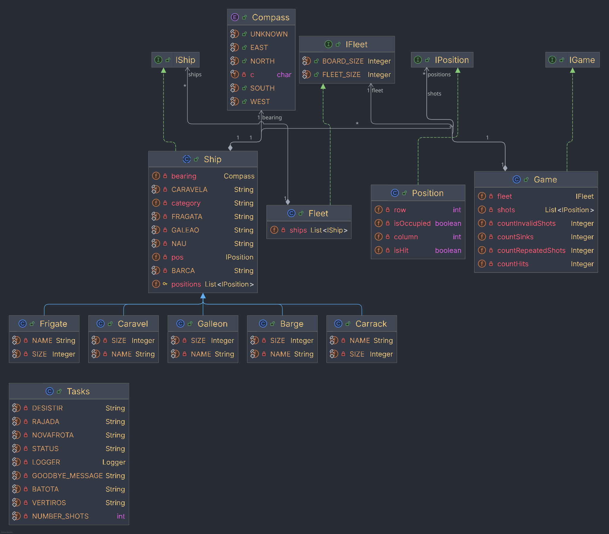

# Class Diagram Architecture

## Class Diagram

## 2. Arquitetura e Modelação do Sistema
A arquitetura da aplicação foi concetualizada com base nos paradigmas avançados de Programação Orientada a Objetos (POO), priorizando a coesão interna, o baixo acoplamento e a extensibilidade modular. A modelação reflete a separação clara entre a representação do domínio espacial, a lógica das entidades marítimas e os contratos de serviço.

### 2.1. Camada de Abstração e Contratos de Interface

De modo a isolar a lógica de negócio das implementações concretas e facilitar a evolução futura do sistema, a estrutura assenta numa arquitetura guiada por contratos (Interface-Driven Design):

* IPosition: Define o contrato para a representação de coordenadas discretas na grelha bidimensional. Permite isolar o cálculo e a navegação espacial da representação em memória.
* IShip: Estabelece a interface universal para qualquer entidade flutuante no tabuleiro. Declara os comportamentos essenciais para consulta da orientação (Bearing), tipologia (category), posição de referência (pos) e a geometria completa de ocupação (positions).
* IFleet: Abstrai a gestão do conjunto de embarcações, encapsulando as operações de agregação, validação espacial e consulta do estado global da frota.

       +--------------+            +------------+
       |  IPosition   |            |   IShip    |
       +--------------+            +------------+
              ^                           ^
              |                           |
       +--------------+            +------------+
       |   Position   |            |    Ship    |
       +--------------+            +------------+
       
# 2.2. Modelação do Domínio e Entidades

### A. Geometria Espacial e Orientação (Position & Bearing)
A localização na grelha é formalizada pela classe Position, que encapsula um par ordenado de coordenadas $(row, col)$. Para garantir o rigor tipográfico no posicionamento tridimensional/bidimensional das embarcações, utiliza-se a enumeração Bearing (NORTH, SOUTH, EAST, WEST, UNKNOWN). Esta enumeração é fundamental para calcular a translação dos pontos ocupados por um navio a partir do seu ponto de âncora.

### B. Hierarquia e Tipologia de Embarcações (Ship)
A classe Ship concretiza a interface IShip e atua como a entidade central do domínio marítimo. A categorização das embarcações (ex.: CARAVELA, FRAGATA, GALEAO, NAU, BARCA) permite associar diferentes geometrias e comportamentos a cada tipo de navio.Encapsulamento de Estado: A classe gere internamente a lista de posições efetivas (List<IPosition>) que a embarcação ocupa na grelha, garantindo que o estado interno só é alterado através de métodos controlados.

### C. Agregação e Controlo de Frota (Fleet)
A classe Fleet implementa IFleet e atua como um agregador de objetos do tipo IShip. É responsável por:Assegurar o cumprimento dos limites operacionais do tabuleiro (BOARD_SIZE).Restringir a dimensão máxima da frota (FLEET_SIZE).Garantir a integridade espacial, prevenindo a sobreposição ilegal de embarcações na mesma coordenada.

# 2.3. Decisões de Design e Padrões Aplicados
1) Separation of Concerns (SoC): Cada classe possui uma responsabilidade única e bem delimitada. A classe Position trata exclusivamente de coordenadas, Ship gere a representação do navio, e Fleet orquestra a coleção de embarcações.

2) Encapsulamento Forte: Os atributos das classes concretas são privados (private), sendo o acesso garantido por métodos seletores (getters) expostos pelas respetivas interfaces.

3) Padrão Imutabilidade (na Posição): As instâncias de Position são projetadas para ser imutáveis após a instanciação, prevenindo efeitos secundários colaterais (side-effects) durante o cálculo de colisões ou movimentações na grelha.
